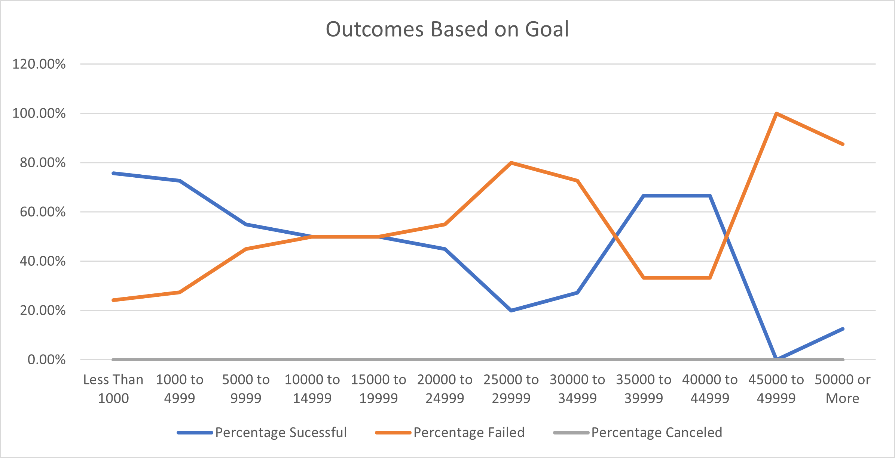
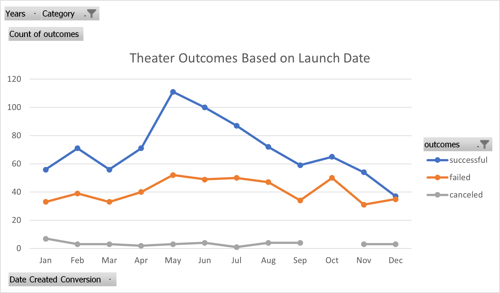

# Excel_Challenge - An Analysis of Kickstarter Campaigns

## Overview of Project

- Using Excel, I performed analysis on Kickstarter Data using many of Microsoft Excel's tools. I utilized Pivot Tables and different types of graphs to identify which subcategories and parent categories of the campaigns performed the best. Then, I used line graphs to identify seasonal/monthly trends within the Theatre campaigns.
- Idetified trends based on Launch Date and Goals

## Analysis and Challenges

- Using Excel, I performed analysis on Kickstarter Data using many of Microsoft Excel's tools. 

- I utilized Pivot Tables and different types of graphs to identify which goal range resulted in the most sucesses for campagins, and identified which launch Date favoured Theater Campaigns. 

## Results

- From the Outcomes vs Goals Graph, it can be seen that the best goal ranges that result in the most sucessful campagins were from $0-5000 and $35000 - 45000. I think it would be the safer and more sucessful option to keep goals at around the 0-5000$ range.
- From the Theater Outcomes vs Launch graph, it can be seen that May would be the best month to launch the campaign as it has the highest count of sucessful campaigns while failed campaigns remain stable throughout the year.
- The limitations from these graphs don't show other factors such as country, number of backers and popularity of the play. These factors could potentially play a big role in determining the sucess of a theater campaign.

